# 🌐 Sui Overflow | Decentralized Interview Database

## 🎯 Track: Explorations - Global Coordination

## ❌ The Problem: Centralized Interview Data

Glassdoor and similar platforms have become the de facto source for interview information, but they come with significant drawbacks:
- Data ownership is centralized
- Companies can pay to remove negative reviews
- Users contribute valuable data but receive no compensation
- Information can be manipulated or censored
- High subscription fees for access to valuable data

In 2024, the interview preparation market was valued at over **$2.4 billion**, yet the contributors of this valuable information receive nothing in return.

## 💡 Our Solution: Community-Owned Interview Database

> 🌐 A decentralized platform where:
> * Interview questions and company data are owned by the community
> * Contributors are rewarded for their insights
> * Data is immutable and transparent
> * Access is fair and equitable

### 🎯 Track Justification

We've chosen the **Explorations Track** with a focus on **Global Coordination** because our project creates a decentralized alternative to Glassdoor by enabling job seekers worldwide to contribute and access interview questions through a community-owned database. By leveraging Sui's blockchain technology, we're building a global knowledge network where contributors are fairly rewarded for sharing their interview experiences, and users can access verified company insights from around the world. This project represents a novel approach to global coordination in the $2.4B interview preparation industry, demonstrating how blockchain technology can create more equitable and transparent systems for sharing professional knowledge that's not owned and sold by private corporations.

## 🧠 How It Works

### 👥 Contribution Flow (Earn Rewards)

1️⃣ Connect your Sui wallet
2️⃣ Submit verified interview questions
3️⃣ Earn **Behavioral Buddy tokens (BBT)** for contributions
4️⃣ Build reputation through quality submissions

### 📚 Access Flow (Prepare Better)

1️⃣ Connect your wallet
2️⃣ Browse company-specific interview questions
3️⃣ Access detailed company insights
4️⃣ Prepare with real, verified data

## 🔄 Quick Flow Recap

```mermaid
graph TD
    A[👤 User] --> B1[📤 Contribution Path]
    A --> B2[🎯 Access Path]
    
    B1 --> C1[🔗 Connect Wallet]
    C1 --> D1[📝 Submit Questions]
    D1 --> E1[🎁 Earn BBT Tokens]
    
    B2 --> C2[🔗 Connect Wallet]
    C2 --> D2[🏢 Select Company]
    D2 --> E2[🗃️ Access Questions]
    E2 --> F2[💪 Prepare for Interview]
```

## 🔗 How We Use Sui

### 🎁 BBT Token

Users earn **BBT** for verified question submissions, leveraging Sui's efficient token system.

### 🗃️ On-chain Interview Database

Interview questions and company data are stored **on-chain** using Sui's object model, creating an immutable, community-owned dataset.

### 👤 Wallet = Identity

We use Sui Wallet as a **pseudonymous identity layer** — ensuring privacy while maintaining accountability.

> ✅ The more you contribute, the more BBT you earn
> 🔍 The more questions you access, the better your interview prep

## ⚙️ Why Sui is the Perfect Fit

| 🔧 Feature                    | 💥 Why It Matters                                        |
| ----------------------------- | -------------------------------------------------------- |
| **Object Model**              | Perfect for storing complex interview data structures    |
| **Low Fees**                  | Micro-rewards stay affordable for all users             |
| **Wallet UX**                 | Seamless onboarding for Web2 users                      |
| **Move Language**             | Secure and efficient data management                     |

> Sui gives us the **performance, security, and scalability** to support a global community of job-seekers.

## 🎯 Vision: The Future of Interview Data

We're building more than just a question database. Our vision is a **fully decentralized career hub** where:
- All data is community-owned
- Contributors are fairly rewarded
- Information is transparent and immutable
- Access is equitable for all

## 💬 Final Pitch

> 🌐 Join us in revolutionizing the **$2.1B interview prep industry** —
> by creating a truly community-owned platform where:
> * Data is transparent and immutable
> * Contributors are fairly rewarded
> * Access is equitable for all
>
> Let's build the future of interview preparation together —
> powered by **Sui**.
>
> **Thank you! 🙌😄**

---

## 🔗 Links

- [Demo Video]()
- [Pitch Deck]()
- [GitHub Repository]() 